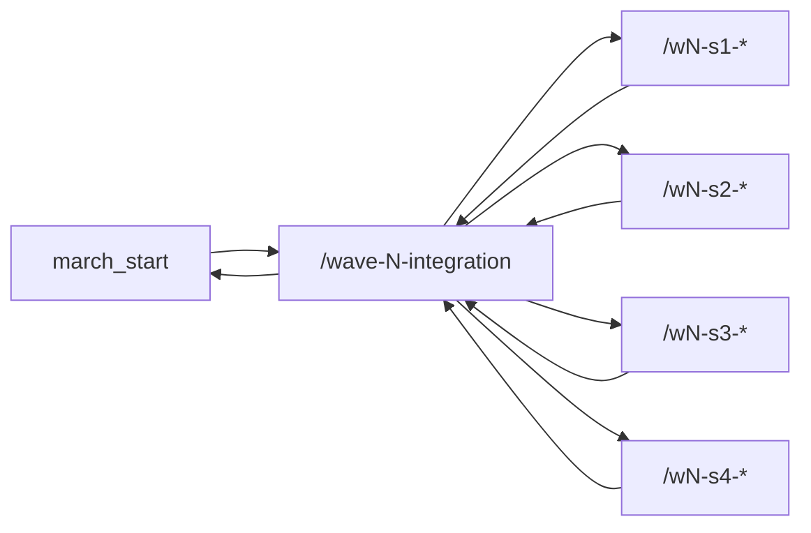

# Operator Runbook: Dispatching Spec Waves with `$spec-dispatch`

This runbook assumes all work starts from the repo root:

`/workspaces/ffthh-game-of-life`

## 1. One-Time Preconditions
1. Open the dev container for this repo.
2. Confirm Git remotes are up to date:

```bash
git fetch origin --prune
```

3. Install UI dependencies once:

```bash
npm --prefix src/ui ci
```

## 2. Wave Branch Strategy
Use a participant prefix for all branches:

- `<your-initials>/wave-N-integration`
- `<your-initials>/wN-sX-...`

Example prefix: `th`

Export your prefix once per terminal session:

```bash
export SPEC_BRANCH_PREFIX=<your-initials>
```

For each wave `N`, create one integration branch and push it:

```bash
git switch march_start
git pull --ff-only origin march_start
git switch -c <your-initials>/wave-N-integration
git push -u origin <your-initials>/wave-N-integration
```

Replace `N` with `1`, `2`, or `3`.

## 3. Create Worktrees (One Per Spec)
Create an in-repo worktree folder for each spec in the wave:

```bash
mkdir -p ./worktrees
```

Example for wave 1:

```bash
git worktree add ./worktrees/W1-S1 -b <your-initials>/w1-s1-setup-data-contracts origin/<your-initials>/wave-1-integration
git worktree add ./worktrees/W1-S2 -b <your-initials>/w1-s2-wizard-modal-ui origin/<your-initials>/wave-1-integration
git worktree add ./worktrees/W1-S3 -b <your-initials>/w1-s3-welcome-screen-ui origin/<your-initials>/wave-1-integration
git worktree add ./worktrees/W1-S4 -b <your-initials>/w1-s4-game-hub-home-ui origin/<your-initials>/wave-1-integration
```

## 4. Launch An Agent Per Spec
In each worktree terminal, run:

```bash
cd ./worktrees/W1-S2
SPEC_BRANCH_PREFIX=<your-initials> codex --yolo "Use $spec-dispatch with spec /workspaces/ffthh-game-of-life/specs/wave-1/W1-S2-wizard-modal-ui.md"
```

Repeat for each Wave 1 spec path, including:

- `/workspaces/ffthh-game-of-life/specs/wave-1/W1-S1-setup-data-contracts.md`
- `/workspaces/ffthh-game-of-life/specs/wave-1/W1-S2-wizard-modal-ui.md`
- `/workspaces/ffthh-game-of-life/specs/wave-1/W1-S3-welcome-screen-ui.md`
- `/workspaces/ffthh-game-of-life/specs/wave-1/W1-S4-game-hub-home-ui.md`

## 5. What The Skill Must Do
The agent using `$spec-dispatch` must:

1. Parse frontmatter from the spec file.
2. Ensure current branch matches the spec `branch`.
3. Implement only files in `owned_paths`.
4. Run all `test_commands` from the spec.
5. Fix until tests are green.
6. Create a PR summary and PR targeting the wave integration branch.

## 6. PR Rules
1. Spec PR base must be the wave integration branch, not `march_start`.
2. Example:
   - Head: `<your-initials>/w1-s2-wizard-modal-ui`
   - Base: `<your-initials>/wave-1-integration`
3. Do not merge the wave branch to `march_start` until all spec PRs for that wave are merged.

## 7. Reintegration Flow (Specs -> Wave -> Central)
Branch flow diagram:



Required reintegration order:

1. Each spec branch PR merges into `<your-initials>/wave-N-integration`.
2. Operator validates the wave branch.
3. Open the wave PR from `<your-initials>/wave-N-integration` to `march_start`.
4. Merge the wave PR to `march_start`.
5. Delete wave/spec branches and remove local worktrees.

## 8. Wave Gate Validation
After all spec PRs in a wave merge into `<your-initials>/wave-N-integration`:

```bash
git switch <your-initials>/wave-N-integration
git pull --ff-only
npm --prefix src/ui run test:ci
npm --prefix src/ui run test:e2e:ci
```

If `test:e2e:ci` requires Chromium, run this in the dev container where `CHROME_BIN=/usr/bin/chromium` is available.

## 9. Open Wave PR To `march_start`

```bash
git push
gh pr create --base march_start --head <your-initials>/wave-N-integration --title "Wave N: High-fidelity Screen implementation" --body "See merged spec PRs in this wave branch."
```

If `gh` is unavailable, open the PR manually in the Git hosting UI.

## 10. Cleanup Worktrees And Branches After Merge
After each spec PR is merged, remove the local worktree and local branch:

```bash
git worktree remove ./worktrees/W1-S2
git branch -d <your-initials>/w1-s2-wizard-modal-ui
```

If a worktree has uncommitted changes and must be removed anyway:

```bash
git worktree remove --force ./worktrees/W1-S2
```

After the wave PR merge to `march_start`, remove remote branches and prune worktree metadata:

```bash
git push origin --delete <your-initials>/w1-s2-wizard-modal-ui
git push origin --delete <your-initials>/wave-1-integration
git worktree prune
```

Optional: remove the empty `worktrees` folder when all waves are complete:

```bash
rmdir ./worktrees
```

## 11. Troubleshooting

### Skill Says Wrong Branch
1. Run `git branch --show-current` in that worktree.
2. Run `git switch <spec-branch>`.
3. Re-run the skill command.

### `gh pr create` fails
1. Run `gh auth status`.
2. If not authenticated, log in or create the PR manually.

### Worktree creation fails (branch exists)
Use the existing branch without `-b`:

```bash
git worktree add ./worktrees/W1-S2 <your-initials>/w1-s2-wizard-modal-ui
```
