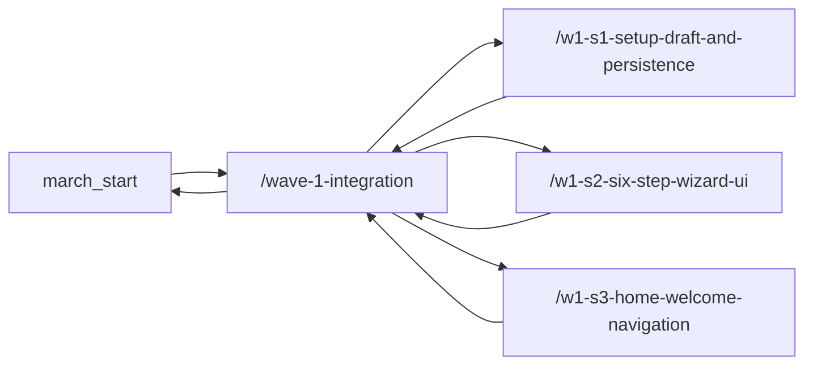

# Operator Runbook: Dispatching Wave 1 From `march_start`

This runbook assumes all work starts from:

`/workspaces/ffthh-game-of-life`

## 1. Preconditions
1. Open the dev container for this repo.
2. Refresh remotes:

```bash
git fetch origin --prune
```

3. Install UI dependencies once:

```bash
npm --prefix src/ui ci
```

## 2. Wave Branch Strategy
Use a participant prefix for all branches:

- `<your initials>/wave-1-integration`
- `<your initials>/w1-s1-setup-draft-and-persistence`
- `<your initials>/w1-s2-six-step-wizard-ui`
- `<your initials>/w1-s3-home-welcome-navigation`

Wave 1 restart base branch: `march_start`

```bash
git switch march_start
git pull --ff-only origin march_start
git switch -c <your initials>/wave-1-integration
git push -u origin <your initials>/wave-1-integration
```

## 3. Create One Worktree Per Spec
```bash
mkdir -p ./worktrees
git worktree add ./worktrees/W1-S1 -b <your initials>/w1-s1-setup-draft-and-persistence origin/<your initials>/wave-1-integration
git worktree add ./worktrees/W1-S2 -b <your initials>/w1-s2-six-step-wizard-ui origin/<your initials>/wave-1-integration
git worktree add ./worktrees/W1-S3 -b <your initials>/w1-s3-home-welcome-navigation origin/<your initials>/wave-1-integration
```

## 4. Launch An Agent Per Spec
Preferred launcher from the main repo checkout:

```bash
bash scripts/spec-launch.sh W1-S1
bash scripts/spec-launch.sh W1-S2
bash scripts/spec-launch.sh W1-S3
```

Useful variants:

```bash
bash scripts/spec-launch.sh W1-S2 pre
bash scripts/spec-launch.sh W1-S2 finalize
```

What the launcher does:
1. Targets `./worktrees/<SPEC_ID>`.
2. Infers `SPEC_BRANCH_PREFIX` from that worktree branch unless already set.
3. Sets local Playwright defaults (`CHROME_BIN`, `PLAYWRIGHT_SKIP_BROWSER_DOWNLOAD`, `VITE_STORAGE_MODE`).
4. Runs `skills/spec-dispatch/scripts/dispatch_spec.sh --phase pre`.
5. Opens `codex` with the repo-local skill instructions from `skills/spec-dispatch/SKILL.md`.

`scripts/spec-launch.sh` is the preferred operator wrapper. `skills/spec-dispatch/scripts/dispatch_spec.sh` is still the enforcement backend for branch setup, owned-path validation, test execution, and PR summary output; it is not deprecated or safe to remove.

## 5. Wave 1 Spec Package
Wave 1 is desktop-only. All screenshot and Playwright coverage must target `1280x720`.

- `W1-S1`: setup draft model, save payload, multi-player persistence, and desktop happy-path E2E coverage
- `W1-S2`: six-step setup wizard UI for desktop, including the new game-name entry step and editable summary title
- `W1-S3`: Game Hub home, Welcome page, routing, and desktop multi-game landing layout

## 6. PR Rules
1. Spec PR base must be `<your initials>/wave-1-integration`.
2. Example:
   - Head: `<your initials>/w1-s2-six-step-wizard-ui`
   - Base: `<your initials>/wave-1-integration`
3. Open the wave PR to `march_start`.

## 7. Reintegration Flow


Required order:
1. Merge each spec PR into `<your initials>/wave-1-integration`.
2. Validate the wave branch.
3. Open the wave PR from `<your initials>/wave-1-integration` to `march_start`.
4. Merge the wave PR to `march_start`.
5. Delete wave/spec branches and remove local worktrees.

## 8. Wave Gate Validation
After all three spec PRs merge into the wave branch:

```bash
git switch <your initials>/wave-1-integration
git pull --ff-only
npm --prefix src/ui run test:ci
npm --prefix src/ui run build
npm --prefix src/ui exec -- playwright test --config src/ui/playwright.config.js src/ui/e2e/app.spec.js src/ui/e2e/home-visual.spec.js src/ui/e2e/welcome-visual.spec.js src/ui/e2e/wizard-visual.spec.js
```

## 9. Open The Wave PR To `march_start`
```bash
git push
gh pr create --base march_start --head <your initials>/wave-1-integration --title "Wave 1: desktop setup flow restart" --body "See merged Wave 1 spec PRs in this wave branch."
```

## 10. Cleanup
After each spec PR is merged:

```bash
git worktree remove ./worktrees/W1-S2
git branch -d <your initials>/w1-s2-six-step-wizard-ui
```

After the wave PR merges to `march_start`:

```bash
git push origin --delete <your initials>/w1-s1-setup-draft-and-persistence
git push origin --delete <your initials>/w1-s2-six-step-wizard-ui
git push origin --delete <your initials>/w1-s3-home-welcome-navigation
git push origin --delete <your initials>/wave-1-integration
git worktree prune
rmdir ./worktrees
```
